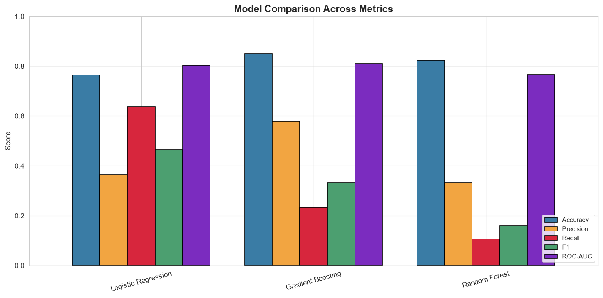
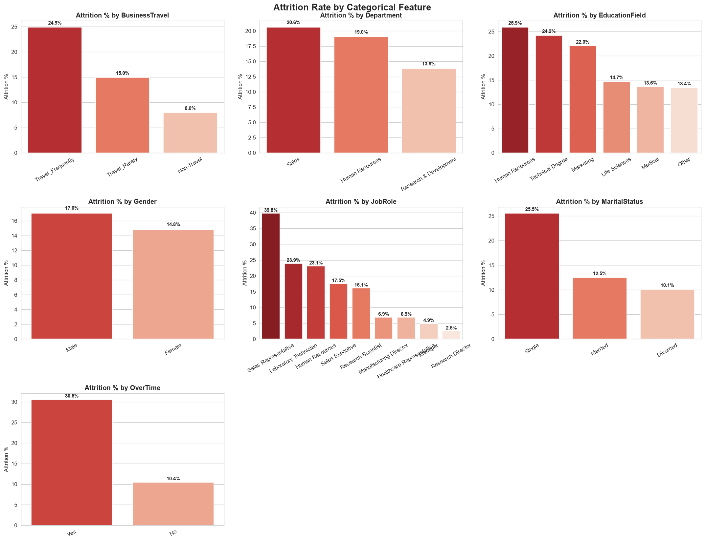
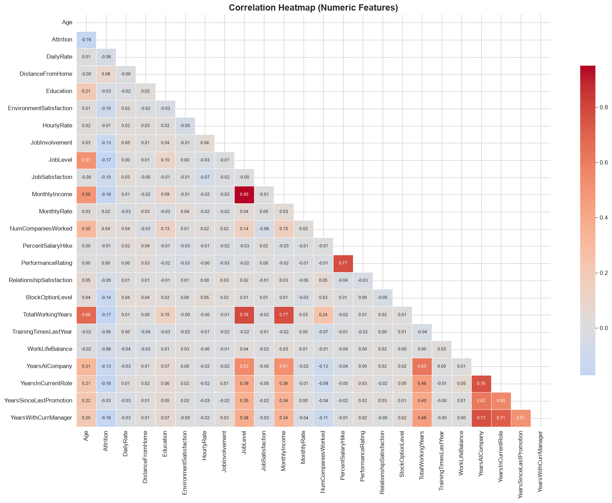
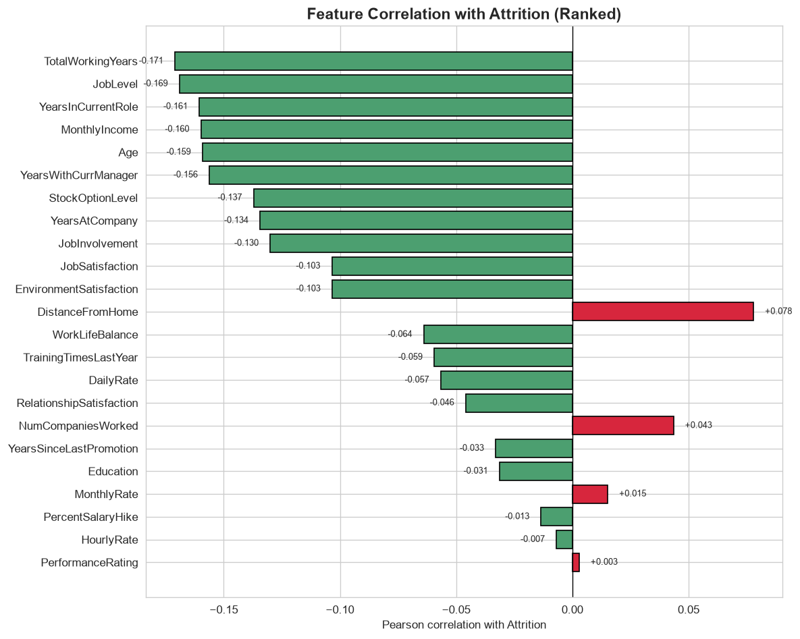
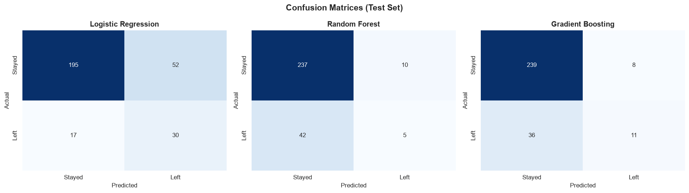

# Employee Attrition Prediction System

An end-to-end Machine Learning application that predicts whether an employee
is likely to leave a company, based on HR analytics data.

Built as a complete production-style pipeline: **data → ML model → web interface**.



---

## 🎯 Problem

Employee turnover is expensive — replacing an employee can cost 50-200% of
their annual salary. HR teams want to identify at-risk employees **before**
they resign, so they can intervene (raise, promotion, schedule change,
manager reassignment).

**Goal:** Given an employee's profile, predict their likelihood of leaving.

---

## 🧠 Approach

| Stage | What was done |
|-------|---------------|
| **Data** | IBM HR Analytics dataset (1,470 employees, 35 features) |
| **Cleaning** | Dropped 4 constant/ID columns, encoded target, verified no nulls |
| **EDA** | Distribution plots, boxplots, correlations, categorical breakdowns |
| **Features** | Added 4 engineered features (income/tenure ratios, manager stability) |
| **Splits** | 80/20 stratified train/test (preserves 16% positive rate) |
| **Models** | Logistic Regression, Random Forest, Gradient Boosting |
| **Imbalance** | `class_weight="balanced"` + SMOTE oversampling |
| **Selection** | Best by F1 (not accuracy — see "Key Insight" below) |
| **Serving** | Joblib serialization → Django web app |

---

## 📊 Model Results

| Model | Accuracy | Precision | Recall | F1 | ROC-AUC |
|-------|----------|-----------|--------|-----|---------|
| **Logistic Regression + SMOTE** 🏆 | 0.7857 | 0.3919 | 0.6170 | **0.4793** | 0.7876 |
| Logistic Regression | 0.7653 | 0.3659 | 0.6383 | 0.4651 | 0.8034 |
| Random Forest + SMOTE | 0.8231 | 0.4242 | 0.2979 | 0.3500 | 0.7371 |
| Gradient Boosting | 0.8503 | 0.5789 | 0.2340 | 0.3333 | 0.8094 |
| Random Forest | 0.8231 | 0.3333 | 0.1064 | 0.1613 | 0.7656 |

### 🔍 Key Insight: Why "accuracy" is the wrong metric

The naive model (predict "Everyone Stays") gets **84% accuracy** — because
84% of employees do stay. But it identifies **zero** at-risk employees, which
is useless for the business.

**F1 and Recall on the minority class** are the metrics that matter here:

- **Recall = 61.7%** → the chosen model catches ~2 out of 3 real leavers
- **F1 = 0.4793** → best precision/recall tradeoff across all 5 models

The "best" model by accuracy (Gradient Boosting, 85%) has only 23% recall —
it misses 3 out of 4 leavers. **Simpler ≠ worse.** This is a real-world
lesson in picking the right metric for the business problem.

---

## 🖼 Screenshots

### Attrition rate by category


**OverTime is the strongest single signal** — employees working overtime
leave at 3× the rate (30.5% vs 10.4%).

### Correlation heatmap


### Feature importance (correlation with target)


### Confusion matrices


---

## 🚀 Running the App

### 1. Clone & set up

```powershell
git clone https://github.com/mxolisi78/EmployeeAttritionML.git
cd EmployeeAttritionML
python -m venv venv
.\venv\Scripts\Activate.ps1
pip install -r requirements.txt
```

### 2. Start the Django server

```powershell
python manage.py migrate
python manage.py runserver
```

### 3. Open in browser

http://127.0.0.1:8000/

Fill in an employee's details → click **Predict Attrition** → get a
probability with a color-coded result card.

📁 Project Structure
text
EmployeeAttritionML/
├── data/
│   ├── raw/                        # Original IBM HR CSV
│   └── processed/                  # Cleaned + feature-engineered datasets
├── notebooks/
│   └── analysis.ipynb              # Full EDA + model training notebook
├── models/
│   ├── attrition_model.joblib      # Trained pipeline (scaler + SMOTE + LR)
│   ├── model_metadata.json         # Feature names + metrics
│   └── model_comparison.csv        # Results table for all 5 models
├── visualizations/                 # Exported charts (10 PNGs)
├── predictor/                      # Django app
│   ├── forms.py                    # Input form matching model features
│   ├── views.py                    # Home + predict views
│   ├── ml/
│   │   ├── loader.py               # Loads saved model once
│   │   └── predict.py              # Form data → feature vector → prediction
│   └── templates/predictor/        # HTML templates
├── attrition_web/                  # Django project config
├── manage.py
├── requirements.txt
└── README.md
🛠 Tech Stack
Python 3.13

Data: pandas, numpy

Visualization: matplotlib, seaborn

ML: scikit-learn, imbalanced-learn (SMOTE)

Persistence: joblib

Web: Django 6.1

Notebook: Jupyter

💡 What I Learned
Class imbalance is the whole game. A model with 85% accuracy can be
worse than one with 76% accuracy if it fails the minority class.

SMOTE has limits. It helped Logistic Regression marginally, hurt
Random Forest. Always compare.

Feature engineering beats feature count. 4 well-chosen engineered
features (income/tenure ratio, manager stability) added real signal.

A model isn't a product until it's deployed. Wrapping the trained
pipeline in a Django app with a real form is what made this project
go from "notebook" to "application."

The simplest model won. Logistic Regression, when balanced, beat
both tree ensembles for this business problem.

🔮 Future Improvements
Add SHAP explanations to show why a specific employee was flagged

Persist predictions to a database + dashboard of at-risk employees

Tune Logistic Regression's C and use GridSearchCV

Dockerize + deploy to Railway/Render

Add authentication so HR managers each see their own reports

## 👤 Author

**Mxolisi**
- GitHub: [@mxolisi78](https://github.com/mxolisi78)
- LinkedIn: [Mxolisi Maseko](https://www.linkedin.com/in/mxolisi-maseko-9810b93a4/)   

text

